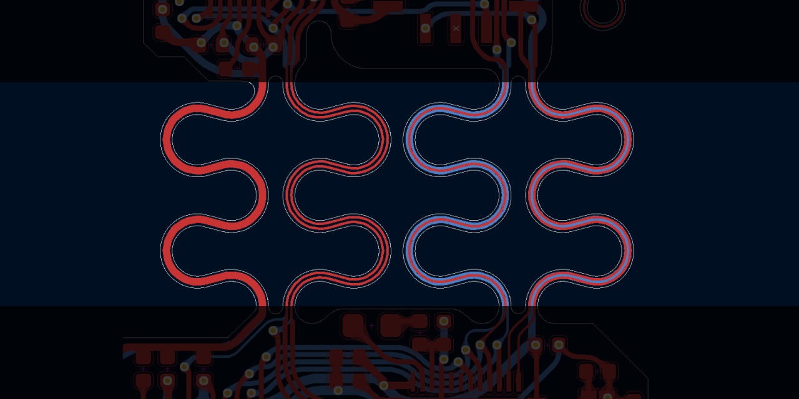

# kicad-serpentine 🐍
 
KiCAD extension for generating serpentine traces, primarily intended for use in developing flexible PCBs for wearable applications. This extension provides the ability to generate round/curved traces on the front and/or back copper layers + edge cuts.



### Trace generation parameters


## Installation

Copy into KiCAD plugins folder; e.g.
```
Documents/KiCAD/7.0/scripting/plugins/kicad-serpentine
```

## Usage Notes

Serpentine edge cuts and traces will likely end on an uneven x,y coordinate.
to connect to these edge cuts and traces, make sure snapping is enabled:

> **Preferences → PCB Editor → Editing Options → Magnetic Points**
> * Snap to pads: When creating tracks (or Always)
> * Snap to tracks: When creating tracks (or Always)
> * Snap to graphics: Always

*note: developed and tested in kicad 7.0. definitely doesn't work in previous versions and I have no clue if it'll work in future versions*
